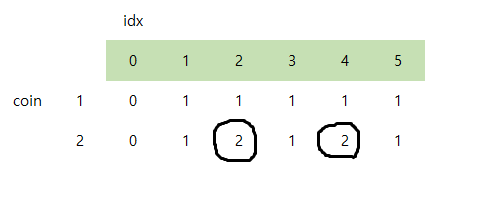

### 첫번째 시도 : 동적 계획법

처음에는 재귀와 메모이제이션을 사용했지만, 시간초과 발생.

```ts
//
// 현재 남은 코인이 remainN 이고,
// coinIndex 번째의 코인을 사용했을 때 방법의 수.
function solve(remainN: number, coinIndex: number): number {
    //
    // 캐싱되어 있다면 그것을 반환.
    // remainN이 음수거나 coinIndex가 범위를 넘어갔다면 0을 반환.
    // remainN이 0이라면 1을 반환.
    ...

    //
    // 핵심 로직
    const coin = coins[coinIndex];
    const q = Math.max(remainN / coin);
    let answer = 0;
    for (let cnt = 0; cnt <= q; cnt++) {
        const nextRemainN = remainN - cnt * coin;
        answer += solve(nextRemainN, coinIndex + 1);
    }

    //
    // 캐싱
    ...

    return answer;
}
```

---

### 두번째 시도 : 점화식으로 풀어내기

2차열 배열을 생성하여 점화식으로 풀어냈지만, 역시 시간초과.

```ts
//
// result[i][n]
// i번째 코인까지 사용하여 n을 만들 수 있는 방법의 수.
const result = [][] as number[][];

for(let i=0; i<coins.length; i++){
    const coin = coins[i];
    if(let j=1; j<=n; j++){
        const r = j % coin;

        //
        // 현재 코인만으로 j원을 만들 수 있는가?
        result[i][j] = r === 0 ? 1 : 0;

        //
        // i-1번째 코인까지 사용한 경우의 수를 추가한다.
        for(let remainN=j; 0 < remainN; remainN-=coin) {
            result[i][j] += result[i-1][remainN];
        }
    }
}

return result[coins.length-1][n];
```


---

### 마지막 시도 : 점화식 개선

문제점은 `i-1번째 코인까지 사용한 경우의 수`를 매번 처음부터 계산하느라 오래걸리는 것.

`i-1번째 코인을 사용한 경우의 수`를 누적하여 중복계산을 방지한다.

<br/>

#### STEP 01.

먼저, 0으로 채운 배열에서부터 시작하여,

해당 코인만으로 n원을 거슬러줄 수 있다면 위의 값에 1을 더한다.

1원은 모든 값을 거슬러줄 수 있으므로 1이 더해지므로 `[1, 1, 1, 1, 1]`이 되고

2원은 짝수 값만 거슬러줄 수 있으므로, 짝수에만 더해져 `[1, 2, 1, 2, 1]`이 된다.



<br/>

#### STEP 02.

아래 그림에서 다음 규칙을 유추할 수 있고,

`(coin=2, remain=3)` += `(coin=1, remain=1)`

`(coin=2, remain=5)` += `(coin=1, remain=1)` + `(coin=1, remain=3)`

`(coin=2, remain=7)` += `(coin=1, remain=1)` + `(coin=1, remain=3)` + `(coin=1, remain=5)`

우항에 규칙성을 발견했으므로 더 빠르게 계산할 수 있다.


